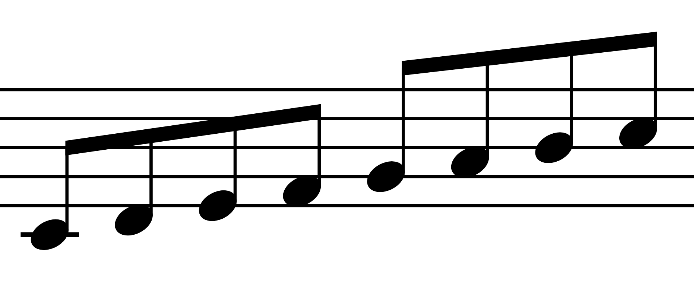
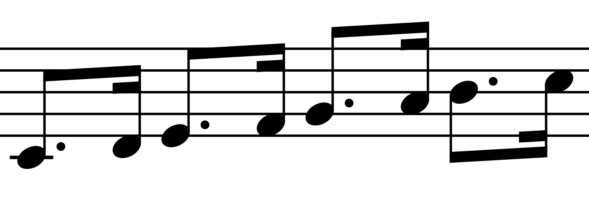
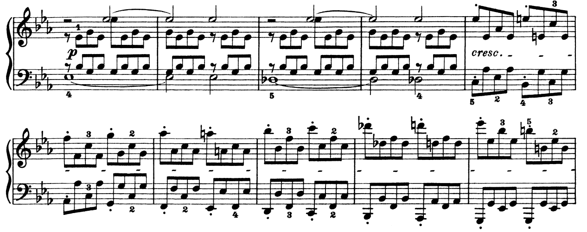
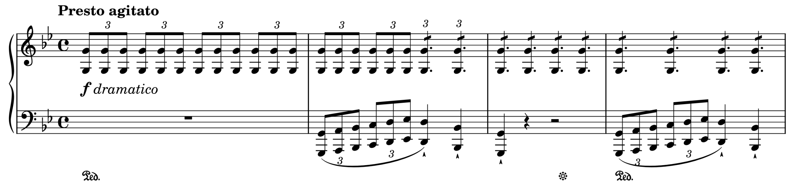
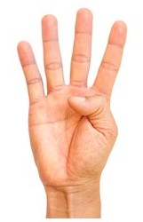

# Technical tips

## General techniques

> "If it works, it works; if it sounds good, it sounds good" <br> &nbsp;&nbsp;&nbsp;&nbsp;&nbsp;&nbsp;**— PZM** <br> FYI: _I swear our advice is more helpful than this_

_Here we’re talking about general techniques, there’s a specific technique section after this!_

1. In general, keep your fingers **curved** when playing. 
2. Practise hands **separately** before putting them together.
3. Find the **best fingerings** when you're practising slowly. Don't practice random fingerings only to find that they don't work for playing faster → experiment with what works best or just ask!
4. Focus on bringing out the **melody**, so maybe just playing the melody instead of all the other notes can be helpful!
5. Make sure to have **good posture** and **relax** your entire body (e.g. hands and shoulders)
6. Have **space** between your elbows and body; it’ll give you more freedom to play!
7. Use **arm weight!** Don’t limit your playing to only your fingers.
8. Try sitting in a **higher seat position**. Most pianists’ elbows are around parallel with the piano keys → this will allow you to put more weight into the keyboard!
9. **Do not implement pedalling** until you are confident that you can play the notes correctly! Playing with a pedal can make it harder to hear if you’re making a nice sound on individual notes.

```admonish tip
Before playing your piece, think about what you are going to play first! This makes you more prepared for the piece and less stressed out.
```

## Scales

> Piano teachers: "So, have you practised your scales?" <br>Student: Disapparates <br> &nbsp;&nbsp;&nbsp;&nbsp;&nbsp;&nbsp;**— LIN**

1. Incredibly important for building **finger dexterity**.
2. Practising scales are a great way to learn how to **lift** your fingers and to **modify** wrist position while making turns.
3. Scales are useful for ~~Vene~~ runs.
4. With scales, try, practicing tucking your thumb under your hand to cross over to the next note that is played with your thumb.
5. Amazing way to warm up your fingers/hands, which is important to play better as well as not sustain any injuries.
6. Don’t accent notes with the thumb.
7. At a fast tempo, you will usually need to also shift your hand position along with tucking your thumb.

```admonish tip
Try playing scales at the beginning of your practice session and aim for clarity. Also try going up (crescendo) and then back down (decrescendo) in volume as you go up and down the keyboard with a scale.  
```

## Pedalling

> "Why is coming up with a quote for pedal so hard? :BigSweat:" <br> &nbsp;&nbsp;&nbsp;&nbsp;&nbsp;&nbsp;**— SamG**

1. Advice from the Piano VI The Great, “Pedal before it gets muddy,” it’s actually very simple advice when it comes to **overpedalling**.
2. Think of pedalling as extra fingers holding down the notes, as such, you want to make sure you’re only sustaining the relevant **harmonies**.
3. A good rule of thumb is to lift the pedal every time the **harmony** changes.

## Arpeggios

> How to play Arpeggios: Don’t <br> **— Piano VI**

1. Make sure you **know** the arpeggio scale.

```admonish example
For F-major arpeggio, it would be F, A, C, F. 
```

2. **Wrist position** is very important:

```admonish tip
On a descending right hand, having a high wrist is very helpful. 
```

3. Make sure your hands are **ascending/descending along with** the notes. Having them stay in the same position will make it harder for you to reach the notes!
4. Try practising the arpeggios with different rhythms like making the first note of the pattern slow while the rest are quick. Switch them up, and visit the original rhythm from time to time until you can play it. This can help you familiarise the movement and position of your hand on every note.

|Normal                                |Dotted                                |Triplets                              |
|--------------------------------------|--------------------------------------|--------------------------------------|
||||

## Phrasing and Dynamics

> It is passion in one’s playing that captivates the listeners, less so wrong notes <br> _(that’s just a “jazzy addition”)_ <br> &nbsp;&nbsp;&nbsp;&nbsp;&nbsp;&nbsp;**— FrozenFighter**

1. Make sure to pay attention to phrasing, “rising up and going back down” - this can often be seen with slurs as it **“rises”** and **“falls”**.
2. **Raising** your **wrist** can be a great way to make a note more **quiet**.
3. **Dropping** your **wrist** on a chord or note can be a great way to **bring it out!**
4. **Sing** the melody of the song! Often times, the shape of your voice on the melody should be the same shape of the melody when you play on the piano.
5. Pay attention to the room you’re playing in, and try to use the **acoustics** of the room to your full **advantage**
6. If you’re not sure about interpretation, try and **look at** how other pianists have played and interpreted it.

```admonish tip
Here’s a great piece recommended by JChan which demonstrates phrasing and attention to dynamics really well: [Schubert’s Impromptu No. 3 (performed by Vladimir Horowitz)](https://youtu.be/FxhbAGwEYGQ). You can really see how the piece seems to rise and fall – with sections of increasing intensity becoming louder. 
```

## Playing Fast Notes

> "If you can play it slowly, you can play it quickly" <br> &nbsp;&nbsp;&nbsp;&nbsp;&nbsp;&nbsp;**— Ben Lee (popularised by TwoSetViolin)** <br> Fyi: don't be like Ben Lee

1. As a piece gets faster, you use more **fingers** rather than wrist.
2. Always **relax** hands and **lift** fingers.
3. Practise **slowly** first, gradually raising the speed (preferably with a metronome!).



<center>
<em>This excerpt from <a href="https://s9.imslp.org/files/imglnks/usimg/f/fb/IMSLP30364-PMLP01410-Beethoven_Sonaten_Piano_Band1_Peters_Op13.pdf">Beethoven’s Sonata No. 8 (Pathetique)</a> (1st movement) is a great example of why the above tips are important to put into *practise*!</em>
</center>

## Practicing Runs

> "vene runs are great" <br> &nbsp;&nbsp;&nbsp;&nbsp;&nbsp;&nbsp;**— null_awe** <br> Watch them on [Animenz Piano Concerto | Happy Birthday! ft. 69 Pianists](https://youtu.be/oGt5KVv24Ag?t=1212) (timestamped!)

Steps to play ~~Vene~~ runs:

1. Look for any **patterns** (scales, arpeggios, etc.) in the runs and mark them out. This will help simplify the run for you.
2. Now look at the remaining sections and write out **fingerings** for them; this one is very important. For any run passage, if you don't use efficient fingerings, this will lead to wrong notes.
3. Practise each section of the run slowly, move your hand in the direction of the run, and use your elbow and maybe even the whole arm to direct your hand. This makes it easier to play the run quickly. 

    - Accent key notes such as those on the first beat/signifying the start of the pattern 

4. Now memorise each section, play it a few times with your eyes open, and then play it a few times with eyes closed. If something is wrong, identify the error and check: is it because of fingering or any other problem?
5. Once you have memorised the run, add the accompanying hand and memorise that as well.
6. Now play the run with both hands, slowly with a metronome. If anything goes wrong here, look back again: is it fingering? Usually, when runs go wrong, it's about inefficient fingering. 
7. Once you have played the run and gotten it up to a decent speed, memorise it! Memorising is key since it's inefficient to play while staring at the notes, especially with passages like runs.

Do the steps above and the run will end up really easy to play.

```admonish note
Don't play any run with the pedal until you have fully learnt it, the pedal will prevent you from knowing the "original" sound of the run.
```

### Extra practice tips for runs

- Play the run in staccato - this helps you to articulate the notes.
- Play the run with over-exaggerated finger lifting and articulation - helps you articulate the notes and build strength.
- If the runs are at a constant note value (e.g., quaver), you can play the run in a dotted-quaver followed by a semiquaver rhythmic fashion. Then afterwards, you reverse it, so it comes a semiquaver followed by a dotted-quaver rhythmic pattern.


- Play with run with “false staccatos”,  where you do a firm staccato without collapsing your fingers, but your fingers still remain on the keys after the “bounce” of the staccato)

## Trilling

> "Trilling is a controlled hand seizure" <br> &nbsp;&nbsp;&nbsp;&nbsp;&nbsp;&nbsp;**— Prancen** <br> Note: if it's _**uncontrolled**_, please see Doctor Yahya for a prescription of Carbamazepine

1. Loosen your fingers when trilling - tense fingers will cause you to play the notes slower.
2. When trilling between two notes, the best fingering to use in general is 2 and 3. However, this may change depending on your preference and if you have to play other notes whilst trilling!
3. When trilling for long periods of time, it is recommended to alternate which fingers you use. e.g. switching between 1&2 for one note and 3 for the other.

## 3 Hand Technique

> "I wish I had 4 ;)" <br> &nbsp;&nbsp;&nbsp;&nbsp;&nbsp;&nbsp;**— aidswidjaja**

1. First, identify the voices (ex: bass, melody, etc.) and which hand is playing which.
2. Practise in **sections**, and practise each voice separately just to get an idea of the role of each hand.
3. Try to play both hands together **slowly** first to get the “feel” of how each hand works in doing the 3 hand technique in that section. 4.Emphasising the main melody can also help you get that “feel” as you can understand how the other voices support the melody.
4. Once you understand the movement of your hands, it may be easier to practise the hands separately to develop independence and to polish.
5. Continue practising at a slow tempo and gradually increase it until you finally master it at the desired tempo.

## Note Jumps

> Jumping Skills: 100 <br> Everything Else: 0 <br> &nbsp;&nbsp;&nbsp;&nbsp;&nbsp;&nbsp;**— Best Boi Yang :D**

1. **Be wary** of **how tense your hand/wrist** is when practising/doing jumps. Don’t keep it too tense as it may cause an injury. 
2. When first learning jumps, practise them by **‘shadow jumping’** - that is, do your jumps without physically pressing into the keys. This is to get you familiarised with the positions of your notes.
3. When you have built the confidence, practise pressing into the keys and jumping at a slow tempo. This is to further familiarise your hands with the notes you are playing. 
4. Gradually raise the tempo for the third step until you can play the desired BPM!
5. If both hands are doing jumps at the same time, focus and master one hand before doing the other.
6. When you have mastered both hands separately, practise slowly together in small phrases.
7. Slowly raise the tempo again!
8. Keep practising until you can play the section masterfully.

```admonish tip
See this more in-depth [video by WattKeys](https://www.youtube.com/watch?v=Za3Cn834h34&t=18s) into ‘shadowing jumping’ & jumps in general.
```

```admonish tip "Bonus tip!"
You can attempt to practice your jumps with your eyes closed if you want to memorise the section faster. Again, start off slow and speed it up gradually, making sure you’re hitting every note correctly!
```

## Octaves

> "Octaves are like j_____ __f: when one does it with extreme vigour, one’s hand shall feel everlasting excruciating pain." <br> &nbsp;&nbsp;&nbsp;&nbsp;&nbsp;&nbsp;**— Myehs**

1. When playing an octave, remember that the **distance** is always the same, be it on black keys or white keys. Once you set your fingers for the distance of an octave, they will almost always hit.
2. While playing an octave with your 1st and 5th finger is the norm, the thumb and ring finger combo is also possible and in some cases more comfortable. Generally, black keys are played with your ring (4th) finger and white with your pinky (5th).
3. Don’t be intimidated by passages such as:

    

    <center>
    <em>The opening to <a href="https://youtu.be/O4pC2Cc_hAo">Liszt’s transcription of Schubert’s Erlkönig</a></em>
    </center>
    <br>

    ```admonish example
    For the above example, loosen up your wrists, but keep your fingers at the same distance. A technique to reduce fatigue would be to alternate your 4th and 5th finger between each octave spam, similar to how you alternate your fingers during a long trill.
    ```

4. Do not over-practise. Once your arms begin to strain, it’s time to take a break. 
5. Don't lose hope. One shall eventually reach the level of doing Heroic Polonaise at full speed with practice (the writer himself hasn't gotten to this yet).
6. After mastering the octave ~~jack~~ spam, you’re gonna also see improvements in other areas outside playing the piano. ( ͡° ͜ʖ ͡°)( ͡° ͜ʖ ͡°)( ͡° ͜ʖ ͡°)

```admonish note
**A note from Myehs:** I have hands that aren’t that big, so when playing octaves, I mostly have to play my fingers flat instead of curving them like you usually do.
```

## Chords

> "I – vi – IV  – V in C Major is all you’ll ever need" <br> &nbsp;&nbsp;&nbsp;&nbsp;&nbsp;&nbsp;**— Music Theory (probably)**

1. Aim to play the notes all at the same time. To do this, keep your fingers at a fixed position and let your wrist/arm be the one to press down on the keys rather than lifting and moving the fingers.
2. To emphasise certain notes of a chord, the fingers of the notes you want emphasised should be lower than the rest. That way, when you press down, the lowered fingers will produce a louder sound, placing emphasis on the notes.
3. To arpeggiate a chord, tilt your wrist such that when you drop your hands to hit the keys, it’ll naturally hit the keys in a certain order, be it ascending or descending.

```admonish tip
[Tips for playing chords](https://youtu.be/m4KrefQBHGs?t=596) (recommended by LIN)
```

## Glissando

> "The pain you feel today will be the strength you'll feel tomorrow" <br> &nbsp;&nbsp;&nbsp;&nbsp;&nbsp;&nbsp;**— Xeter**

### Myehs' gliss

<div class="flexbox" style="margin-bottom: 0px">
<div class="flexbox flexbox-main-content" style="width: 80%; margin-bottom: 0px">

- One thing to keep in mind: when glissing, what you’re trying to do is to keep the same position while sliding your finger from point A to point B. The less friction you have with the keys, the better and less painful.
- When glissing down, I usually gliss with the 1st finger, like the position of the hand as shown in picture.

</div>

<div class="flexbox flexbox-side-content" style="width: 10%; margin-bottom: 0px">



</div>
</div>

- When glissing up, the 2nd - 4th finger is what I usually go to. The idea is that your thumb is as resilient in maintaining the gliss as 2-3 of your other fingers. However, in some cases, I would actually use my 4th and 5th finger to gliss.


```admonish note
Gliss with any finger you like, this is just an example.
```

```admonish warning
Trim your nails if you're glissing with them.
```

### Xeter's gliss

- Keep in mind that building a resistance against the pain that you feel when playing a glissando takes time so you have to be very patient. Your fingers will get used to it and the more you do it the less painful it will be.
- When glissing down one of the most important factors is your wrist positioning. When trying to reduce pain and injuries it's better to use the top of your thumb than it is to use the side. In order to be able to use the top part you have to put your wrist up quite high and a little bit into the direction which you will be glissing into. Try to lead the movement from your wrist and not from your arm or fingers.
- For upwards glisses there are 2 different ways in which they can be done 

    1. You can use the nail part of your thumb resulting in a slightly cleaner gliss
    2. You can use the part in between your 1st and 2nd knuckle.  
